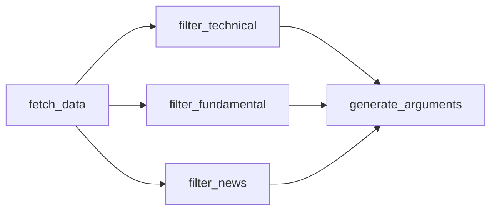

After `fetch_data` completes, the graph fans out to three filter nodes that run **in parallel**. Each node takes one slice of the raw data from `TickerState`, sends it to `llm_filter` (`gpt-4o-mini`, temperature `0.0`), and writes a plain-text summary back to the state. The three summaries are then consumed by `generate_arguments`.



<Note>
The LangGraph pipeline in `agents/graph.py` implements the filter logic inline as graph nodes. `agents/filter_agents.py` also exists and provides standalone class-based equivalents (`TechnicalFilterAgent`, `FundamentalFilterAgent`, `NewsFilterAgent`) with a shared `extract_summary` helper. The classes use the raw OpenAI client directly rather than LangChain and are not wired into the LangGraph graph — they are available as standalone utilities.
</Note>

## Shared model: `llm_filter`

All three filter nodes use the same `ChatOpenAI` instance:

```python agents/graph.py
llm_filter = ChatOpenAI(
    model=LLM_FILTER_MODEL,   # "gpt-4o-mini"
    temperature=0.0,
    timeout=30,
    max_retries=2,
)
```

`temperature=0.0` ensures deterministic, fact-based summaries without creative elaboration.

---

## `filter_technical`

Analyzes the raw technical indicator snapshot for a ticker and produces a directional summary.

```python agents/graph.py
def filter_technical(state: TickerState) -> dict:
    ticker = state["ticker"]
    t0 = time.time()

    prompt = f"""Estatus: Actuando como Analista Técnico Cuantitativo.
Tarea: Analizarás las métricas técnicas (precios, SMA, RSI, MACD, etc) proporcionados para la acción {ticker}.
Objetivo: Identifica si la tendencia es alcista, neutral o bajista basándote excluyentemente en los indicadores proporcionados.
Ignora detalles irrelevantes, proporciona un resumen claro, concreto y objetivo. Extrae sólo la esencia que impacte al precio a corto/mediano plazo."""

    response = llm_filter.invoke([
        {"role": "system", "content": prompt},
        {"role": "user", "content": f"Datos Crudos:\n{json.dumps(state['tech_data'], indent=2)}"}
    ])

    elapsed = round(time.time() - t0, 1)
    print(f"  [{ticker}] Agente Técnico: {elapsed}s")
    return {"tech_summary": response.content}
```

### Input: `tech_data`

`tech_data` is produced by `get_latest_technical_summary` in `data_fetcher/technicals.py`. It contains the most recent row of computed indicators from 6 months of OHLCV history:

```json
{
  "date": "2026-03-28",
  "close": 172.45,
  "volume": 58312400,
  "sma_20": 169.10,
  "sma_50": 165.80,
  "sma_200": 158.33,
  "rsi_14": 58.30,
  "macd": 1.2345,
  "macd_histogram": 0.4321,
  "bb_upper": 178.90,
  "bb_lower": 162.30,
  "atr_14": 3.12
}
```

All values are `null` if the indicator could not be computed (e.g. insufficient history for SMA_200). The entire dict is `{}` if yfinance history fetch failed.

### System prompt

The system prompt instructs the model to act as a quantitative technical analyst, identify whether the trend is bullish, neutral, or bearish, and produce a clear, concise summary based exclusively on the provided indicators — ignoring irrelevant details.

### Output

<ResponseField name="tech_summary" type="string" required>
  Plain-text technical analysis summary. Written directly to `TickerState["tech_summary"]`. Describes trend direction and the key indicators driving the conclusion.
</ResponseField>

### Error handling

If `tech_data` is an empty dict `{}`, the LLM receives an empty JSON object and will note the absence of data in its response. The node does not raise an exception — it degrades gracefully and returns whatever text the model produces.

---

## `filter_fundamental`

Evaluates fundamental ratios to assess whether the company shows strength, overvaluation, or structural weakness.

```python agents/graph.py
def filter_fundamental(state: TickerState) -> dict:
    ticker = state["ticker"]
    t0 = time.time()

    prompt = f"""Estatus: Actuando como Analista Fundamental.
Tarea: Analizarás los ratios fundamentales (P/E, ROI, EPS, Márgenes, etc) proporcionados para la empresa {ticker}.
Objetivo: Evalúa si los fundamentales demuestran solidez, sobrevaloración o debilidad estructural.
Ignora detalles irrelevantes, proporciona un resumen claro, concreto y objetivo de las métricas que más pueden afectar al valor en bolsa."""

    response = llm_filter.invoke([
        {"role": "system", "content": prompt},
        {"role": "user", "content": f"Datos Crudos:\n{json.dumps(state['fund_data'], indent=2)}"}
    ])

    elapsed = round(time.time() - t0, 1)
    print(f"  [{ticker}] Agente Fundamental: {elapsed}s")
    return {"fund_summary": response.content}
```

### Input: `fund_data`

`fund_data` is produced by `get_fundamental_summary` in `data_fetcher/fundamentals.py`. It maps 19 display names to values from `yf.Ticker.info`:

```json
{
  "P/E": 27.4,
  "Forward P/E": 24.1,
  "PEG": 2.31,
  "P/S": 6.85,
  "P/B": 43.2,
  "Dividend %": "0.55%",
  "ROE": "147.25%",
  "ROA": "22.61%",
  "Debt/Eq": 151.86,
  "Gross Margin": "45.59%",
  "Oper. Margin": "30.74%",
  "Profit Margin": "25.31%",
  "EPS (ttm)": 6.43,
  "EPS Forward": 7.10,
  "Revenue Growth": "5.89%",
  "Earnings Growth": "10.12%",
  "Market Cap": "$2,650,000,000,000",
  "52W High": 199.62,
  "52W Low": 124.17,
  "Beta": 1.29
}
```

Values shown as `"N/A"` when not available in yfinance. Percentage fields (ROE, margins, growth rates) are pre-formatted as human-readable strings to improve LLM interpretation. Contains `{"error": "..."}` if yfinance info fetch fails entirely.

### System prompt

The system prompt instructs the model to act as a fundamental analyst, evaluate whether the metrics demonstrate strength, overvaluation, or structural weakness, and produce a clear, objective summary of the ratios most likely to affect stock value.

### Output

<ResponseField name="fund_summary" type="string" required>
  Plain-text fundamental analysis summary. Written to `TickerState["fund_summary"]`. Focuses on the metrics most likely to move the stock price.
</ResponseField>

### Error handling

If `fund_data` contains `{"error": "..."}`, the model receives that error string as the raw data. The node does not raise — the error text flows through as the summary content and `generate_arguments` handles it via the `state.get('fund_summary', 'Sin datos fundamentales')` fallback.

---

## `filter_news`

Synthesizes recent news headlines into a sentiment verdict and identifies the 2–3 most important narratives.

```python agents/graph.py
def filter_news(state: TickerState) -> dict:
    ticker = state["ticker"]
    t0 = time.time()

    prompt = f"""Estatus: Actuando como Analista de Sentimiento de Noticias.
Tarea: Analizarás los siguientes titulares de noticias recientes sobre la empresa {ticker}.
Objetivo: Sintetiza el sentimiento general (positivo, neutral o negativo) y extrae los 2 o 3 eventos o narrativas clave más importantes.
Ignora ruido publicitario, concéntrate en hechos o anuncios que puedan alterar la perspectiva de inversión a corto plazo."""

    response = llm_filter.invoke([
        {"role": "system", "content": prompt},
        {"role": "user", "content": f"Datos Crudos:\n{json.dumps(state['news_data'], indent=2)}"}
    ])

    elapsed = round(time.time() - t0, 1)
    print(f"  [{ticker}] Agente Noticias: {elapsed}s")
    return {"news_summary": response.content}
```

### Input: `news_data`

`news_data` is produced by `get_newsapi_news` in `data_fetcher/news.py`. It is a list of up to 10 articles from the last 3 days, sourced from Reuters, AP, Bloomberg, WSJ, Fortune, Financial Post, Washington Post, BBC, Axios, and Politico.

```json
[
  {
    "date": "2026-03-28",
    "time": "14:30:00",
    "headline": "Apple reports record services revenue in Q1",
    "source": "Reuters",
    "link": "https://reuters.com/..."
  },
  {
    "date": "2026-03-27",
    "time": "09:15:00",
    "headline": "Apple faces EU antitrust investigation over App Store",
    "source": "Bloomberg",
    "link": "https://bloomberg.com/..."
  }
]
```

<Tip>
If the initial query returns no results with the curated source list, `get_newsapi_news` automatically retries without the `sources` filter to maximize coverage.
</Tip>

### System prompt

The system prompt instructs the model to act as a news sentiment analyst, synthesize the overall sentiment (positive, neutral, or negative), and extract the 2–3 most important events or narratives. It explicitly filters out advertising noise in favor of facts and announcements that could alter the short-term investment outlook.

### Output

<ResponseField name="news_summary" type="string" required>
  Plain-text news sentiment summary. Written to `TickerState["news_summary"]`. Includes an overall sentiment label and the key narratives identified from the headlines.
</ResponseField>

### Error handling

If `news_data` contains `[{"error": "..."}]` (e.g. missing `NEWSAPI_KEY`), the model receives that error object. The node does not raise — the error flows through as the summary, and `generate_arguments` handles missing summaries with `state.get('news_summary', 'Sin datos de noticias')`.

---

## Parallel execution

LangGraph runs the three filter nodes concurrently using its built-in fan-out mechanism. The edges from `fetch_data` to all three nodes are registered with `add_edge`, and LangGraph schedules them in parallel automatically:

```python agents/graph.py
builder.add_edge("fetch_data", "filter_technical")
builder.add_edge("fetch_data", "filter_fundamental")
builder.add_edge("fetch_data", "filter_news")
```

<Warning>
Parallel execution means all three filter nodes make simultaneous API calls to OpenAI. Ensure your API rate limits can accommodate 3 concurrent requests per ticker being processed.
</Warning>

---

## Standalone classes (`agents/filter_agents.py`)

`agents/filter_agents.py` provides class-based equivalents of the three filter nodes. These classes use the raw `openai` Python client directly (not LangChain) and are not connected to the LangGraph graph. They are available as standalone utilities if you want to call individual filter agents outside the pipeline.

### `extract_summary`

Shared helper function called by all three classes:

```python agents/filter_agents.py
def extract_summary(system_prompt: str, raw_data: str) -> str:
    """Invoca la API de OpenAI para filtrar la información cruda."""
    client = OpenAI(api_key=os.environ.get("OPENAI_API_KEY"))

    if not client.api_key or client.api_key == "INSERTA_TU_KEY_AQUI":
        return "ERROR: OPENAI_API_KEY no configurada correctamente en el archivo .env."

    try:
        response = client.chat.completions.create(
            model=LLM_FILTER_MODEL,
            messages=[
                {"role": "system", "content": system_prompt},
                {"role": "user", "content": f"Datos Crudos:\n{raw_data}"}
            ],
            temperature=0.0
        )
        return response.choices[0].message.content
    except Exception as e:
        return f"Error en la llamada de LLM: {str(e)}"
```

### Class interfaces

| Class | Method | Input type | Description |
|---|---|---|---|
| `TechnicalFilterAgent` | `.process(ticker, technical_data)` | `dict` | Analyzes technical indicators |
| `FundamentalFilterAgent` | `.process(ticker, fundamental_data)` | `dict` | Analyzes fundamental ratios |
| `NewsFilterAgent` | `.process(ticker, news_data)` | `list` | Analyzes news headlines |

All three `.process()` methods return a plain-text summary string identical in format to the LangGraph node outputs.
