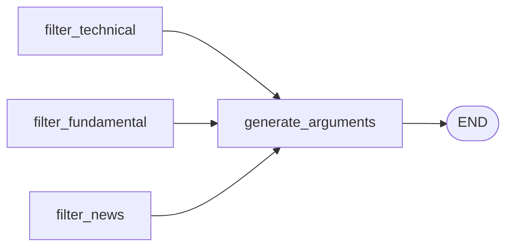

`generate_arguments` is the final node in the MEME agent graph. It receives the three plain-text summaries from the parallel filter nodes and synthesizes them into a structured list of investment arguments — each with a polarity, a logical thesis, and a supporting piece of evidence.

<Note>
  The LangGraph pipeline implements the generator logic as the `generate_arguments` node in `agents/graph.py`. A standalone class-based equivalent, `ArgumentGeneratorAgent`, also exists in `agents/generator_agent.py`. Both share the same prompt structure and JSON output format, but `ArgumentGeneratorAgent` uses the raw OpenAI client instead of LangChain and is not wired into the graph.
</Note>

## Overview

- **Node name:** `generate_arguments` (in `agents/graph.py`)
- **Standalone class:** `ArgumentGeneratorAgent` (in `agents/generator_agent.py`)
- **Model:** `gpt-4o` (`LLM_EXTRACTOR_MODEL`), temperature `0.2`
- **Response format:** `json_object` (enforced via OpenAI API)
- **Position in graph:** fan-in after all three filter nodes; directly precedes `END`



## Model configuration

```python agents/graph.py
llm_generator = ChatOpenAI(
    model=LLM_EXTRACTOR_MODEL,   # "gpt-4o"
    temperature=0.2,
    timeout=45,
    max_retries=2,
    model_kwargs={"response_format": {"type": "json_object"}},
)
```

`temperature=0.2` allows slight variation in phrasing while still producing focused, structured output. The `json_object` response format guarantees the model returns valid JSON, eliminating most parsing failures.

## Input

`generate_arguments` reads three fields from `TickerState`:

<ParamField path="ticker" type="string" required>
  The stock ticker symbol. Injected into the system prompt and stamped onto every argument in the output list.
</ParamField>

<ParamField path="tech_summary" type="string">
  Plain-text technical analysis summary produced by `filter_technical`. Defaults to `"Sin datos técnicos"` if not present in state.
</ParamField>

<ParamField path="fund_summary" type="string">
  Plain-text fundamental analysis summary produced by `filter_fundamental`. Defaults to `"Sin datos fundamentales"` if not present in state.
</ParamField>

<ParamField path="news_summary" type="string">
  Plain-text news sentiment summary produced by `filter_news`. Defaults to `"Sin datos de noticias"` if not present in state.
</ParamField>

The user message passed to the model is assembled from these three summaries:

```python agents/graph.py
user_message = f"""[Resumen Técnico]
{state.get('tech_summary', 'Sin datos técnicos')}

[Resumen Fundamental]
{state.get('fund_summary', 'Sin datos fundamentales')}

[Resumen de Noticias]
{state.get('news_summary', 'Sin datos de noticias')}"""
```

## System prompt

```python agents/graph.py
system_prompt = f"""Actúas como el Agente Generador del Sistema MEME.
Se te proporcionan resúmenes limpios de una acción ({ticker}) divididos en tres modalidades: Técnico, Fundamental y Noticias.

Tu tarea es sintetizar toda esta información y extraer una lista estructurada de 'Argumentos de Inversión'.
Cada argumento debe representar una narrativa lógica subyacente de por qué el precio podría subir o bajar.

Debes devolver UNICAMENTE un JSON con la siguiente estructura:
{{
  "argumentos": [
    {{
      "polaridad": +1 o -1,
      "justificacion": "La tesis o razonamiento abstracto de este argumento (máximo un párrafo)",
      "evidencia": "Un hecho, ratio o evento directo extraído de los resúmenes que respalde la justificación"
    }}
  ]
}}

Genera al menos 2 y máximo 5 argumentos basados exclusivamente en la información provista."""
```

The prompt constrains the model to:

- Act as the MEME Generator Agent
- Produce only investment arguments grounded in the provided summaries — no external knowledge
- Return between **2 and 5 arguments**
- Use `+1` for bullish arguments and `-1` for bearish arguments
- Limit `justificacion` to one paragraph

## Output format

`generate_arguments` returns a dict with a single key `arguments`:

```python agents/graph.py
return {"arguments": args}
```

Each element in `args` is a dict with four keys:

<ResponseField name="arguments" type="list" required>
  List of structured investment argument objects, between 2 and 5 items.

  <Expandable title="argument object">
    <ResponseField name="polaridad" type="number" required>
      Sentiment direction. `+1` indicates a bullish argument (price likely to rise); `-1` indicates a bearish argument (price likely to fall).
    </ResponseField>
    <ResponseField name="justificacion" type="string" required>
      The abstract logical thesis for the argument — one paragraph explaining the narrative driving price movement.
    </ResponseField>
    <ResponseField name="evidencia" type="string" required>
      A concrete fact, ratio, or event extracted directly from the filter summaries that supports the justification.
    </ResponseField>
    <ResponseField name="ticker" type="string" required>
      The ticker symbol, injected by `generate_arguments` after JSON parsing. Ensures each argument is identifiable when multiple tickers are processed in the same pipeline run.
    </ResponseField>
  </Expandable>
</ResponseField>

### Example output

```json
[
  {
    "polaridad": 1,
    "justificacion": "The stock shows strong bullish momentum driven by price trading well above its 50-day and 200-day moving averages, combined with solid fundamentals and positive earnings revisions.",
    "evidencia": "Close at $172.45 is 4.0% above SMA_50 ($165.80) and 8.9% above SMA_200 ($158.33); EPS Forward of $7.10 represents a 10% YoY improvement.",
    "ticker": "AAPL"
  },
  {
    "polaridad": -1,
    "justificacion": "Ongoing regulatory scrutiny in Europe introduces headline risk that could weigh on services segment growth expectations.",
    "evidencia": "Bloomberg reported an active EU antitrust investigation into the App Store, which accounts for a significant portion of the company's high-margin services revenue.",
    "ticker": "AAPL"
  }
]
```

## JSON parsing logic

Because `llm_generator` uses `response_format: json_object`, the response is almost always valid JSON. However, the parser handles three cases defensively:

```python agents/graph.py
try:
    content = response.content
    # Strip code fences if model wraps output in markdown
    if content.startswith("```json"):
        content = content[7:-3]
    elif content.startswith("```"):
        content = content[3:-3]

    parsed = json.loads(content)

    # Accept the standard {"argumentos": [...]} wrapper
    if isinstance(parsed, dict) and "argumentos" in parsed:
        args = parsed["argumentos"]
    # Accept a bare list
    elif isinstance(parsed, list):
        args = parsed
    # Accept any other dict as a single argument
    else:
        args = [parsed]
except Exception as e:
    args = [{"error": f"Error parseando JSON: {e}"}]
```

| Case | Detection | Handling |
|---|---|---|
| Standard `{"argumentos": [...]}` | `isinstance(parsed, dict) and "argumentos" in parsed` | Extracts the list directly |
| Bare JSON array | `isinstance(parsed, list)` | Uses the list as-is |
| Markdown code fence (`\`\`\`json`) | `content.startswith("```json")` | Strips 7 leading and 3 trailing characters |
| Generic code fence (`\`\`\``) | `content.startswith("```")` | Strips 3 leading and 3 trailing characters |
| Any other JSON structure | fallthrough `else` | Wraps the dict in a single-element list |
| Parse failure | `except Exception` | Returns `[{"error": "Error parseando JSON: <message>"}]` |

<Warning>
If JSON parsing fails completely, `arguments` will contain a single error dict. Downstream components (clustering, portfolio builder) should check for the presence of an `"error"` key before processing arguments.
</Warning>

## Ticker injection

After parsing, the ticker symbol is stamped onto every argument:

```python agents/graph.py
for arg in args:
    if isinstance(arg, dict):
        arg["ticker"] = ticker
```

This ensures each argument carries its origin ticker, which is essential when the pipeline processes multiple tickers and arguments from different tickers are aggregated for clustering.

## Full node implementation

```python agents/graph.py
def generate_arguments(state: TickerState) -> dict:
    """Generates structured investment arguments from the 3 summaries."""
    ticker = state["ticker"]
    t0 = time.time()

    system_prompt = f"""Actúas como el Agente Generador del Sistema MEME.
Se te proporcionan resúmenes limpios de una acción ({ticker}) divididos en tres modalidades: Técnico, Fundamental y Noticias.

Tu tarea es sintetizar toda esta información y extraer una lista estructurada de 'Argumentos de Inversión'.
Cada argumento debe representar una narrativa lógica subyacente de por qué el precio podría subir o bajar.

Debes devolver UNICAMENTE un JSON con la siguiente estructura:
{{
  "argumentos": [
    {{
      "polaridad": +1 o -1,
      "justificacion": "La tesis o razonamiento abstracto de este argumento (máximo un párrafo)",
      "evidencia": "Un hecho, ratio o evento directo extraído de los resúmenes que respalde la justificación"
    }}
  ]
}}

Genera al menos 2 y máximo 5 argumentos basados exclusivamente en la información provista."""

    user_message = f"""[Resumen Técnico]
{state.get('tech_summary', 'Sin datos técnicos')}

[Resumen Fundamental]
{state.get('fund_summary', 'Sin datos fundamentales')}

[Resumen de Noticias]
{state.get('news_summary', 'Sin datos de noticias')}"""

    response = llm_generator.invoke([
        {"role": "system", "content": system_prompt},
        {"role": "user", "content": user_message}
    ])

    elapsed = round(time.time() - t0, 1)
    print(f"  [{ticker}] Agente Generador: {elapsed}s")

    try:
        content = response.content
        if content.startswith("```json"):
            content = content[7:-3]
        elif content.startswith("```"):
            content = content[3:-3]

        parsed = json.loads(content)

        if isinstance(parsed, dict) and "argumentos" in parsed:
            args = parsed["argumentos"]
        elif isinstance(parsed, list):
            args = parsed
        else:
            args = [parsed]
    except Exception as e:
        args = [{"error": f"Error parseando JSON: {e}"}]

    for arg in args:
        if isinstance(arg, dict):
            arg["ticker"] = ticker

    return {"arguments": args}
```

---

## Standalone class (`agents/generator_agent.py`)

`ArgumentGeneratorAgent` in `agents/generator_agent.py` provides a class-based alternative that uses the raw `openai` client instead of LangChain. It is not wired into the LangGraph graph but implements the same prompt and JSON parsing logic.

```python agents/generator_agent.py
class ArgumentGeneratorAgent:
    def __init__(self):
        self.client = OpenAI(api_key=os.environ.get("OPENAI_API_KEY"))

    def generate(
        self,
        ticker: str,
        tech_summary: str,
        fund_summary: str,
        news_summary: str,
    ) -> list:
        ...
```

### Method: `generate`

<ParamField path="ticker" type="str" required>
  The stock ticker symbol. Injected into the system prompt and the output argument dicts.
</ParamField>

<ParamField path="tech_summary" type="str" required>
  Plain-text technical analysis summary from a filter agent.
</ParamField>

<ParamField path="fund_summary" type="str" required>
  Plain-text fundamental analysis summary from a filter agent.
</ParamField>

<ParamField path="news_summary" type="str" required>
  Plain-text news sentiment summary from a filter agent.
</ParamField>

Returns a list of argument dicts (`polaridad`, `justificacion`, `evidencia`), or `[{"error": "..."}]` on API or parsing failure. The class does **not** inject `ticker` into the output dicts (unlike the graph node, which does).
