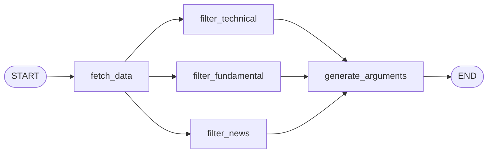

The file `agents/graph.py` defines the end-to-end LangGraph pipeline for a single stock ticker. It exports one singleton — `ticker_graph` — that you invoke to run the full analysis.

## Overview

`ticker_graph` is a compiled `StateGraph` that moves data through four sequential stages:

```
START → fetch_data → [filter_technical, filter_fundamental, filter_news] → generate_arguments → END
```

The three filter nodes run in **parallel** (LangGraph fan-out) after `fetch_data` completes, then converge (fan-in) into `generate_arguments`, which returns the final investment arguments.

## `TickerState`

`TickerState` is a `TypedDict` that serves as the shared state object passed between every node in the graph. You populate the `ticker` field before invoking the graph; all other fields are filled in by the nodes.

```python agents/graph.py
class TickerState(TypedDict):
    ticker: str
    # Raw data (Stage 1)
    tech_data: dict
    fund_data: dict
    news_data: list
    # Filtered summaries (Stage 2 — parallel)
    tech_summary: str
    fund_summary: str
    news_summary: str
    # Final arguments (Stage 3)
    arguments: list
    # Execution timings
    timings: dict
```

<ParamField path="ticker" type="string" required>
  The stock ticker symbol to analyze (e.g. `"AAPL"`, `"MSFT"`). This is the only field you must supply when calling `ticker_graph.invoke`.
</ParamField>

<ParamField path="tech_data" type="dict">
  Raw technical indicators for the ticker, produced by `fetch_data` via `get_latest_technical_summary`. Contains keys such as `close`, `sma_20`, `rsi_14`, `macd`, `bb_upper`, etc. Empty dict `{}` if yfinance history is unavailable.
</ParamField>

<ParamField path="fund_data" type="dict">
  Fundamental ratios produced by `fetch_data` via `get_fundamental_summary`. Contains keys such as `P/E`, `ROE`, `EPS (ttm)`, `Market Cap`, `Beta`, etc. Contains `{"error": "..."}` if yfinance info is unavailable.
</ParamField>

<ParamField path="news_data" type="list">
  List of recent news articles produced by `fetch_data` via `get_newsapi_news`. Each item is a dict with `date`, `time`, `headline`, `source`, and `link`. Contains `[{"error": "..."}]` on failure.
</ParamField>

<ParamField path="tech_summary" type="string">
  Plain-text technical analysis summary written by `filter_technical`. Empty string until that node has run.
</ParamField>

<ParamField path="fund_summary" type="string">
  Plain-text fundamental analysis summary written by `filter_fundamental`. Empty string until that node has run.
</ParamField>

<ParamField path="news_summary" type="string">
  Plain-text news sentiment summary written by `filter_news`. Empty string until that node has run.
</ParamField>

<ParamField path="arguments" type="list">
  List of structured investment argument dicts produced by `generate_arguments`. Each item contains `polaridad`, `justificacion`, `evidencia`, and `ticker`. Empty list until that node has run.
</ParamField>

<ParamField path="timings" type="dict">
  Execution time in seconds for each data-fetching step. Keys: `yfinance` (float), `newsapi` (float). Set by `fetch_data`.
</ParamField>

## LLM configuration

Two `ChatOpenAI` instances are created once at module load time and reused for every invocation.

```python agents/graph.py
llm_filter = ChatOpenAI(
    model=LLM_FILTER_MODEL,   # "gpt-4o-mini"
    temperature=0.0,
    timeout=30,       # 30 s — prevents hanging on slow responses
    max_retries=2,    # retry up to 2 times on failure
)

llm_generator = ChatOpenAI(
    model=LLM_EXTRACTOR_MODEL,   # "gpt-4o"
    temperature=0.2,
    timeout=45,
    max_retries=2,
    model_kwargs={"response_format": {"type": "json_object"}},
)
```

| Instance | Model | Temperature | Timeout | Response format |
|---|---|---|---|---|
| `llm_filter` | `gpt-4o-mini` | `0.0` | 30 s | plain text |
| `llm_generator` | `gpt-4o` | `0.2` | 45 s | `json_object` |

Model names are imported from `config.py` as `LLM_FILTER_MODEL` and `LLM_EXTRACTOR_MODEL`.

## `build_ticker_graph()`

`build_ticker_graph` constructs and compiles the `StateGraph`. It is called once at module load time; you do not need to call it yourself.

```python agents/graph.py
def build_ticker_graph():
    builder = StateGraph(TickerState)

    # Register nodes
    builder.add_node("fetch_data", fetch_data)
    builder.add_node("filter_technical", filter_technical)
    builder.add_node("filter_fundamental", filter_fundamental)
    builder.add_node("filter_news", filter_news)
    builder.add_node("generate_arguments", generate_arguments)

    # Stage 1 → Stage 2: fan-out to three parallel filter nodes
    builder.add_edge(START, "fetch_data")
    builder.add_edge("fetch_data", "filter_technical")
    builder.add_edge("fetch_data", "filter_fundamental")
    builder.add_edge("fetch_data", "filter_news")

    # Stage 2 → Stage 3: fan-in from all three filter nodes
    builder.add_edge("filter_technical", "generate_arguments")
    builder.add_edge("filter_fundamental", "generate_arguments")
    builder.add_edge("filter_news", "generate_arguments")

    # Stage 3 → END
    builder.add_edge("generate_arguments", END)

    return builder.compile()


# Compiled singleton — import and use directly
ticker_graph = build_ticker_graph()
```

### Graph topology



## The `fetch_data` node

`fetch_data` is the first node. It creates a single `yf.Ticker` object and reuses it for both the price history and fundamentals calls to avoid duplicate network connections.

```python agents/graph.py
def fetch_data(state: TickerState) -> dict:
    ticker = state["ticker"]
    timings = {}

    t0 = time.time()
    yf_ticker = yf.Ticker(ticker)

    try:
        price_df = yf_ticker.history(period="6mo")
    except Exception as e:
        print(f"  [WARN] {ticker}: yfinance history error: {e}")
        price_df = None

    if price_df is not None and not price_df.empty:
        tech_data = get_latest_technical_summary(price_df.copy())
    else:
        tech_data = {}

    fund_data = get_fundamental_summary(ticker, yf_ticker=yf_ticker)
    timings["yfinance"] = round(time.time() - t0, 1)

    t0 = time.time()
    news_data = get_newsapi_news(ticker, days_back=3)
    timings["newsapi"] = round(time.time() - t0, 1)

    return {
        "tech_data": tech_data,
        "fund_data": fund_data,
        "news_data": news_data,
        "timings": timings,
    }
```

**What it fetches:**

- **yfinance history** — 6 months of OHLCV data, passed to `get_latest_technical_summary` which computes SMA, RSI, MACD, Bollinger Bands, and ATR and returns the most recent row as a dict.
- **yfinance fundamentals** — ticker `.info` from the same `yf.Ticker` object, mapped to 19 key ratios by `get_fundamental_summary`.
- **NewsAPI** — up to 10 articles from the last 3 days via `get_newsapi_news`, sourced from Reuters, AP, Bloomberg, WSJ, and others.

## Invoking the graph

Import `ticker_graph` and call `.invoke` with a minimal state dict that contains the `ticker` key.

```python
from agents.graph import ticker_graph

result = ticker_graph.invoke({"ticker": "AAPL"})
```

The return value is the final `TickerState` dict with all fields populated:

```python
{
    "ticker": "AAPL",
    "tech_data": { "date": "2026-03-28", "close": 172.45, "rsi_14": 58.3, ... },
    "fund_data": { "P/E": 27.4, "ROE": "147.25%", "Market Cap": "$2,650,000,000,000", ... },
    "news_data": [ { "date": "2026-03-28", "headline": "Apple reports record...", ... } ],
    "tech_summary": "The trend is bullish...",
    "fund_summary": "Fundamentals show solid margins...",
    "news_summary": "Sentiment is positive driven by...",
    "arguments": [
        {
            "polaridad": 1,
            "justificacion": "Strong momentum supported by...",
            "evidencia": "RSI at 58 with price above SMA_50",
            "ticker": "AAPL"
        }
    ],
    "timings": { "yfinance": 1.2, "newsapi": 0.8 }
}
```

<Note>
You only need to provide `ticker` in the input dict. LangGraph merges your input into the initial state and populates all remaining fields as each node runs.
</Note>
